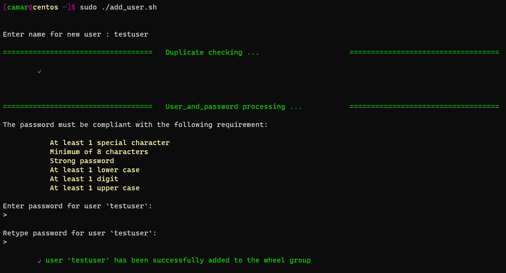

**<h1 align="center"> Welcome to </h1>**
<h1 align="center"><strong> ADD USER </strong></h1>

<p align="center">

</p>

<p align="center">

</p>

<br/>


<br/>


<p align="justify"> This script automates adding users on RHEL-based linux system with duplication, password and privilege management. Code tested on Centos Stream 9.

<br/>


#
### Usage
#

> Make sure :
* to make updates beforehand if applicable

<br/>

> Clone the repo with the following from a terminal :

```Bash
$ git clone https://github.com/camarh/add_user.sh
```

<br/>

> From a terminal, run the script with sudo :
```Bash
$ sudo ./add_user.sh
```
[](https://github.com/camarh/domain_extractor/stargazers)


#
### Project Info
#

<div>Name &nbsp;&nbsp;&nbsp;&nbsp;&nbsp;&nbsp;&nbsp;&nbsp;&nbsp;&nbsp;&nbsp;&nbsp;&nbsp;&nbsp;&nbsp;&nbsp; &nbsp;&nbsp;&nbsp;&nbsp;&nbsp;&nbsp;&nbsp;&nbsp;&nbsp;&nbsp;&nbsp;&nbsp;&nbsp;&nbsp;&nbsp;&nbsp;Creation date&nbsp;&nbsp;&nbsp;&nbsp;&nbsp;&nbsp;&nbsp;&nbsp;&nbsp;&nbsp;&nbsp;&nbsp;Author&nbsp;&nbsp;&nbsp;&nbsp;&nbsp;&nbsp;&nbsp;&nbsp; Programming language</div>

#

<div>add_user.sh&nbsp;&nbsp;&nbsp;&nbsp;&nbsp;&nbsp;&nbsp;&nbsp;&nbsp;&nbsp;&nbsp;&nbsp;&nbsp;&nbsp;&nbsp;&nbsp;&nbsp;&nbsp;&nbsp;&nbsp;&nbsp;&nbsp;&nbsp;&nbsp;&nbsp;July 9, 2023&nbsp;&nbsp;&nbsp;&nbsp;&nbsp;&nbsp;&nbsp;&nbsp;&nbsp;&nbsp;&nbsp;&nbsp;&nbsp;&nbsp;&nbsp;Camar H.&nbsp;&nbsp;&nbsp;&nbsp; Bash</div>

<br/>

### Feel free to reach me

- Email - &nbsp;&nbsp;&nbsp;&nbsp; <camar.houssein@outlook.com>
- Linkedin - <https://www.linkedin.com/in/camarh/>

#
If you enjoy this project, give it a
[](https://github.com/camarh/domain_extractor/stargazers)


#

© 2023 Camar H.
#

